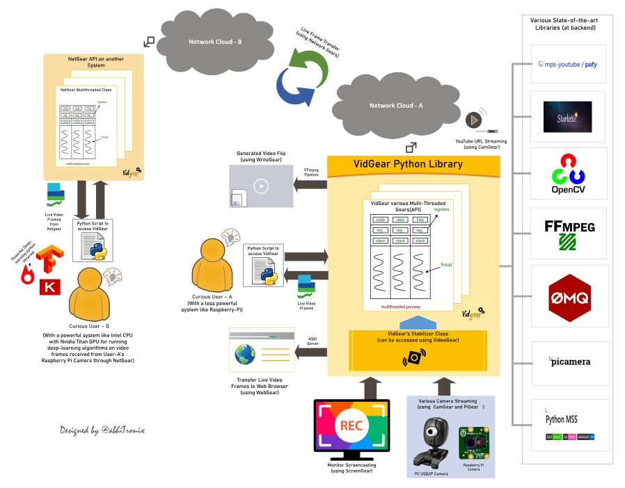

<!--
===============================================
vidgear library source-code is deployed under the Apache 2.0 License:

Copyright (c) 2019-2020 Abhishek Thakur(@abhiTronix) <abhi.una12@gmail.com>

Licensed under the Apache License, Version 2.0 (the "License");
you may not use this file except in compliance with the License.
You may obtain a copy of the License at

   http://www.apache.org/licenses/LICENSE-2.0

Unless required by applicable law or agreed to in writing, software
distributed under the License is distributed on an "AS IS" BASIS,
WITHOUT WARRANTIES OR CONDITIONS OF ANY KIND, either express or implied.
See the License for the specific language governing permissions and
limitations under the License.
===============================================
-->

<h1 align="center">
  
</h1>
<h2 align="center">
  
</h2>

<div align="center">

[Releases][release]&nbsp;&nbsp;&nbsp;|&nbsp;&nbsp;&nbsp;[Gears][gears]&nbsp;&nbsp;&nbsp;|&nbsp;&nbsp;&nbsp;[Documentation][docs]&nbsp;&nbsp;&nbsp;|&nbsp;&nbsp;&nbsp;[Installation][installation]&nbsp;&nbsp;&nbsp;|&nbsp;&nbsp;&nbsp;[License](#license)

[![Build Status][travis-cli]][travis] [![Codecov branch][codecov]][code] [![Build Status][appveyor]][app]

[![Glitter chat][gitter-bagde]][gitter] [![PyPi version][pypi-badge]][pypi] [![Twitter][twitter-badge]][twitter-intent]

[![Code Style][black-badge]][black]

</div>

&nbsp;

VidGear is a high-performance Video Processing python library that provides an easy-to-use, highly extensible, **Multi-Threaded + Asyncio wrapper** around many state-of-the-art specialized libraries like *[OpenCV][opencv], [FFmpeg][ffmpeg], [ZeroMQ][zmq], [picamera][picamera], [starlette][starlette], [pafy][pafy] and [python-mss][mss]* at its backend, and enable us to flexibly exploit their internal parameters and methods, while silently delivering robust error-handling and unparalleled real-time performance.

VidGear primarily focuses on simplicity, and thereby lets programmers and software developers to easily integrate and perform Complex Video Processing Tasks, in just a few lines of code.

&nbsp;

The following **functional block diagram** clearly depicts the generalized functioning of VidGear APIs:

<p align="center">
  
</p>

&nbsp;

# Table of Contents

* [**TL;DR**](#tldr)
* [**Getting Started**](#getting-started)
* [**Gears: What are these?**](#gears)
  * [**CamGear**](#camgear)
  * [**PiGear**](#pigear)
  * [**VideoGear**](#videogear)
  * [**ScreenGear**](#screengear)
  * [**WriteGear**](#writegear)
  * [**StreamGear**](#streamgear)
  * [**NetGear**](#netgear)
  * [**WebGear**](#webgear)
  * [**NetGear_Async**](#netgear_async)
* [**Documentation**](#documentation)
* [**Community Channel**](#community-channel)
* [**Contributions & Support**](#contributions--support)
  * [**Support**](#support)
  * [**Contributors**](#contributors)
* [**Citation**](#citation)
* [**Copyright**](#copyright)


&nbsp;

&nbsp;


# TL;DR
  
#### What is vidgear?

> *"VidGear is a High-Performance Framework that provides an all-in-one complete Video Processing solution for building real-time applications in python."*

#### What does it do?

> *"VidGear can read, write, process, send & receive video frames from/to various devices in real-time."*

#### What is its purpose?

> *"Built with simplicity in mind, VidGear lets programmers and software developers to easily integrate and perform complex Video Processing tasks in their existing or new applications, in just a [few lines of code][switch_from_cv]. Beneficial for both, if you're new to programming with Python language or already a pro at it."*


&nbsp;

&nbsp;

## Getting Started

If this is your first time using VidGear, head straight to the [Installation ➶][installation] to install VidGear.

Once you have VidGear installed, **checkout its well-documented [Gears ➶][gears]**

Also, if you're already familar with [OpenCV][opencv] library, then see [Switching from OpenCV ➶][switch_from_cv]

Or, if you're just getting started with OpenCV with Python, then see [here ➶](https://abhitronix.github.io/vidgear/help/general_faqs/#im-new-to-python-programming-or-its-usage-in-computer-vision-how-to-use-vidgear-in-my-projects)

&nbsp;

&nbsp;


## Gears: What are these?

> **VidGear is built with multiple [Gears][gears] (APIs), each with some unique functionality.**

Each of these APIs is exclusively designed to handle/control different device-specific video streams, network streams, and media encoders. These APIs provide an easy-to-use, highly extensible, multi-threaded and asyncio layer above state-of-the-art libraries under the hood to exploit their internal parameters and methods flexibly while providing robust error-handling and unparalleled performance. 

**These Gears can be classified as follows:**

**A. VideoCapture Gears:**

  * [**CamGear:**](#camgear) Multi-threaded API targeting various IP-USB-Cameras/Network-Streams/YouTube-Video-URLs.
  * [**PiGear:**](#pigear) Multi-threaded API targeting  various Raspberry Pi Camera Modules.
  * [**ScreenGear:**](#screengear) Multi-threaded ultra-fast Screencasting.    
  * [**VideoGear:**](#videogear) Common API with internal [Video Stabilizer](https://abhitronix.github.io/vidgear/gears/stabilizer/overview/) wrapper.

**B. VideoWriter Gears:**

  * [**WriteGear:**](#writegear) Handles Flexible Lossless Video Encoding and Compression.

**C. Streaming Gears:**

  * [**StreamGear**](#streamgear): Handles Ultra-Low Latency, High-Quality, Dynamic & Adaptive Streaming Formats.


**D. Network Gears:**

  * [**NetGear:**](#netgear) Handles high-performance video-frames & data transfer between interconnecting systems over the network.

  * **Asynchronous I/O Network Gears:**

    * [**WebGear:**](#webgear) ASGI Video Server that can send live video-frames to any web browser on the network.
    * [**NetGear_Async:**](#netgear_async) Immensely Memory-efficient Asyncio video-frames network messaging framework.


&nbsp;

&nbsp;


## CamGear

<p align="center">
  
</p>

> *CamGear can grab ultra-fast frames from diverse range of devices/streams, which includes almost any IP/USB Cameras, multimedia video file format ([_upto 4k tested_][test-4k]), various network stream protocols such as `http(s), rtp, rstp, rtmp, mms, etc.`, plus support for live Gstreamer's stream pipeline and YouTube video/live-streams URLs.*

CamGear provides a flexible, high-level multi-threaded wrapper around `OpenCV's` [VideoCapture class][opencv-vc] with access almost all of its available parameters and also employs [`pafy`][pafy] python APIs for live [YouTube streaming][youtube-doc]. Furthermore, CamGear relies exclusively on [**Threaded Queue mode**][TQM-doc] for ultra-fast, error-free and synchronized frame handling.

### CamGear API Guide:

[**>>> Usage Guide**][camgear-doc]

&nbsp;

&nbsp;


## VideoGear

> *VideoGear API provides a special internal wrapper around VidGear's exclusive [**Video Stabilizer**][stablizer-doc] class.*

VideoGear also act as a Common API, that provides an internal access to both [CamGear](#camgear) and [PiGear](#pigear) APIs and their parameters, with a special `enablePiCamera` boolean flag.

VideoGear is basically ideal when you need to switch to different video sources without changing your code much. Also, it enables easy stabilization for various video-streams _(real-time or not)_  with minimum effort and using way fewer lines of code.


**Below is a snapshot of a VideoGear Stabilizer in action  (_See its detailed usage [here][stablizer-doc-ex]_):**

<p align="center">
  
  <br>
  <sub><i>Original Video Courtesy <a href="http://liushuaicheng.org/SIGGRAPH2013/database.html" title="opensourced video samples database">@SIGGRAPH2013</a></i></sub>
</p>

**Code to generate above result:**

```python
# import required libraries
from vidgear.gears import VideoGear
import numpy as np
import cv2

# open any valid video stream with stabilization enabled(`stabilize = True`)
stream_stab = VideoGear(source = "test.mp4", stabilize = True).start()

# open same stream without stabilization for comparison
stream_org = VideoGear(source = "test.mp4").start()

# loop over
while True:

    # read stabilized frames
    frame_stab = stream_stab.read()

    # check for stabilized frame if Nonetype
    if frame_stab is None:
        break

    # read un-stabilized frame
    frame_org = stream_org.read()

    # concatenate both frames
    output_frame = np.concatenate((frame_org, frame_stab), axis=1)

    # put text over concatenated frame
    cv2.putText(
        output_frame, "Before", (10, output_frame.shape[0] - 10), cv2.FONT_HERSHEY_SIMPLEX,
        0.6, (0, 255, 0), 2,
    )
    cv2.putText(
        output_frame, "After", (output_frame.shape[1] // 2 + 10, output_frame.shape[0] - 10),
        cv2.FONT_HERSHEY_SIMPLEX,
        0.6, (0, 255, 0), 2,
    )

    # Show output window
    cv2.imshow("Stabilized Frame", output_frame)

    # check for 'q' key if pressed
    key = cv2.waitKey(1) & 0xFF
    if key == ord("q"):
        break

# close output window
cv2.destroyAllWindows()

# safely close both video streams
stream_org.stop()
stream_stab.stop()
```

### VideoGear API Guide:

[**>>> Usage Guide**][videogear-doc]

&nbsp;

&nbsp;


## PiGear

<p align="center">
  
</p>

> *PiGear is similar to CamGear but made to support various Raspberry Pi Camera Modules *(such as [OmniVision OV5647 Camera Module][OV5647-picam] and [Sony IMX219 Camera Module][IMX219-picam])*.*

PiGear provides a flexible multi-threaded wrapper around complete [picamera](https://picamera.readthedocs.io/en/release-1.13/index.html) python library, and also provides us the ability to exploit almost all of its parameters like `brightness, saturation, sensor_mode, iso, exposure, etc.` effortlessly. Furthermore, PiGear supports multiple camera modules, such as in case of Raspberry Pi Compute module IO boards.

Best of all, PiGear provides excellent error-handling with features like a **Threaded Internal Timer** - that keeps active track of any frozen-threads/hardware-failures robustly, and exit safely if it does occurs, i.e. If you're running PiGear API in your script, and someone accidentally pulls Camera module cable out, instead of going into possible kernel panic, PiGear will exit safely to save resources. 


**Code to open picamera stream with variable parameters in PiGear API:**

```python
# import required libraries
from vidgear.gears import PiGear
import cv2

# add various Picamera tweak parameters to dictionary
options = {"hflip": True, "exposure_mode": "auto", "iso": 800, "exposure_compensation": 15, "awb_mode": "horizon", "sensor_mode": 0}

# open pi video stream with defined parameters
stream = PiGear(resolution = (640, 480), framerate = 60, logging = True, **options).start() 

# loop over
while True:

    # read frames from stream
    frame = stream.read()

    # check for frame if Nonetype
    if frame is None:
        break


    # {do something with the frame here}


    # Show output window
    cv2.imshow("Output Frame", frame)

    # check for 'q' key if pressed
    key = cv2.waitKey(1) & 0xFF
    if key == ord("q"):
        break

# close output window
cv2.destroyAllWindows()

# safely close video stream
stream.stop()
```
### PiGear API Guide:

[**>>> Usage Guide**][pigear-doc]

&nbsp;

&nbsp;


## ScreenGear

> *ScreenGear is designed exclusively for ultra-fast Screencasting, that means it can grab frames from your monitor in real-time, either by define an area on the computer screen, or full-screen, at the expense of inconsiderable latency. ScreenGear also seamlessly support frame capturing from multiple monitors.*

ScreenGear implements a multi-threaded wrapper around [**python-mss**][mss] python library API and also supports a easy and flexible direct internal parameter manipulation. 

**Below is a snapshot of a ScreenGear API in action:**

<p align="center">
  
</p>

**Code to generate the above results:**

```python
# import required libraries
from vidgear.gears import ScreenGear
import cv2

# open video stream with default parameters
stream = ScreenGear().start()

# loop over
while True:

    # read frames from stream
    frame = stream.read()

    # check for frame if Nonetype
    if frame is None:
        break


    # {do something with the frame here}


    # Show output window
    cv2.imshow("Output Frame", frame)

    # check for 'q' key if pressed
    key = cv2.waitKey(1) & 0xFF
    if key == ord("q"):
        break

# close output window
cv2.destroyAllWindows()

# safely close video stream
stream.stop()
```

### ScreenGear API Guide:

[**>>> Usage Guide**][screengear-doc]


&nbsp;

&nbsp;


## WriteGear

<p align="center">
  
</p>

> *WriteGear handles various powerful Writer Tools that provide us the freedom to do almost anything imagine with multimedia files.*

WriteGear API provides a complete, flexible and robust wrapper around [**FFmpeg**][ffmpeg], a leading multimedia framework. With WriteGear, we can process real-time frames into a lossless compressed video-file with any suitable specification in just few easy lines of codes. These specifications include setting video/audio properties such as `bitrate, codec, framerate, resolution, subtitles,  etc.`, and also performing complex tasks such as multiplexing video with audio in real-time _(see this [doc][live-audio-doc])_, while handling all errors robustly. 

Best of all, WriteGear grants the complete freedom to play with any FFmpeg parameter with its exclusive **Custom Commands function** _(see this [doc][custom-command-doc])_, without relying on any Third-party library.

In addition to this, WriteGear also provides flexible access to [**OpenCV's VideoWriter API**][opencv-writer] which provides some basic tools for video frames encoding but without compression.

**WriteGear primarily operates in the following two modes:**

  * **Compression Mode:** In this mode, WriteGear utilizes powerful [**FFmpeg**][ffmpeg] inbuilt encoders to encode lossless multimedia files. This mode provides us the ability to exploit almost any parameter available within FFmpeg, effortlessly and flexibly, and while doing that it robustly handles all errors/warnings quietly. *You can find more about this mode [here ➶][cm-writegear-doc]*

  * **Non-Compression Mode:**  In this mode, WriteGear utilizes basic [**OpenCV's inbuilt VideoWriter API**][opencv-vw] tools. This mode also supports all parameters manipulation available within VideoWriter API, but it lacks the ability to manipulate encoding parameters and other important features like video compression, audio encoding, etc. *You can learn about this mode [here ➶][ncm-writegear-doc]*

### WriteGear API Guide:

[**>>> Usage Guide**][writegear-doc]

&nbsp;

&nbsp;


## StreamGear

<p align="center">
  
</p>


> *StreamGear automates transcoding workflow for generating Ultra-Low Latency, High-Quality, Dynamic & Adaptive Streaming Formats (such as MPEG-DASH) in just few lines of python code.*

StreamGear provides a standalone, highly extensible and flexible wrapper around [**FFmpeg**][ffmpeg] - a leading multimedia framework, for generating chunked-encoded media segments of the content.

SteamGear API automatically transcodes source videos/audio files & real-time frames, and breaks them into a sequence of multiple smaller chunks/segments (typically 2-4 seconds in length) at different quality levels _(i.e. different bitrates or spatial resolutions)_. It also creates a Manifest file _(such as MPD in-case of DASH)_ that describes these segment information _(timing, URL, media characteristics like video resolution and bit rates)_, and is provided to the client prior to the streaming session. Thereby, segments are served on a web server and can be downloaded through HTTP standard compliant GET requests. This makes it possible to stream videos at different quality levels, and to switch in the middle of a video from one quality level to another one – if bandwidth permits – on a per segment basis.


SteamGear currently only supports [**MPEG-DASH**](https://www.encoding.com/mpeg-dash/) _(Dynamic Adaptive Streaming over HTTP, ISO/IEC 23009-1)_ , but other adaptive streaming technologies such as Apple HLS, Microsoft Smooth Streaming, will be added soon.

**StreamGear primarily works in two independent modes for transcoding which serves different purposes:**

  * **Single-Source Mode:** In this mode, StreamGear transcodes entire video/audio file _(as opposed to frames by frame)_ into a sequence of multiple smaller chunks/segments for streaming. This mode works exceptionally well, when you're transcoding lossless long-duration videos(with audio) for streaming and required no extra efforts or interruptions. But on the downside, the provided source cannot be changed or manipulated before sending onto FFmpeg Pipeline for processing.  This mode can be easily activated by assigning suitable video path as input to `-video_source` attribute, during StreamGear initialization. ***Learn more about this mode [here ➶][ss-mode-doc]***

  * **Real-time Frames Mode:** When no valid input is received on `-video_source` attribute, StreamGear API activates this mode where it directly transcodes video-frames _(as opposed to a entire file)_, into a sequence of multiple smaller chunks/segments for streaming. In this mode, StreamGear supports real-time [`numpy.ndarray`](https://numpy.org/doc/1.18/reference/generated/numpy.ndarray.html#numpy-ndarray) frames, and process them over FFmpeg pipeline. But on the downside, audio has to added manually _(as separate source)_ for streams. ***Learn more about this mode [here ➶][rtf-mode-doc]***


### StreamGear API Guide:

[**>>> Usage Guide**][streamgear-doc]

&nbsp;

&nbsp;

## NetGear

<p align="center">
  
</p>

> *NetGear is exclusively designed to transfer video frames synchronously and asynchronously between interconnecting systems over the network in real-time.*

NetGear implements a high-level wrapper around [**PyZmQ**][pyzmq] python library that contains python bindings for [ZeroMQ][zmq] - a high-performance asynchronous distributed messaging library that provides a message queue, but unlike message-oriented middleware, its system can run without a dedicated message broker. 

NetGear provides seamless support for [*Bidirectional data transmission*][netgear_bidata_doc] between receiver(client) and sender(server) through bi-directional synchronous messaging patterns such as zmq.PAIR _(ZMQ Pair Pattern)_ & zmq.REQ/zmq.REP _(ZMQ Request/Reply Pattern)_. 

NetGear also supports real-time [*Frame Compression capabilities*][netgear_compression_doc] for optimizing performance while sending the frames directly over the network, by encoding the frame before sending it and decoding it on the client's end automatically in real-time. 

For security, NetGear implements easy access to ZeroMQ's powerful, smart & secure Security Layers, that enables [*Strong encryption on data*][netgear_security_doc], and unbreakable authentication between the Server and the Client with the help of custom certificates/keys and brings easy, standardized privacy and authentication for distributed systems over the network. 

Best of all, NetGear can robustly handle [*Multiple Server-Systems*][netgear_multi_server_doc] and [*Multiple Client-Systems*][netgear_multi_client_doc] and at once, thereby providing access to seamless Live Streaming of the multiple device in a network at the same time.


**NetGear as of now seamlessly supports three ZeroMQ messaging patterns:**

* [**`zmq.PAIR`**][zmq-pair] _(ZMQ Pair Pattern)_ 
* [**`zmq.REQ/zmq.REP`**][zmq-req-rep] _(ZMQ Request/Reply Pattern)_
* [**`zmq.PUB/zmq.SUB`**][zmq-pub-sub] _(ZMQ Publish/Subscribe Pattern)_

Whereas supported protocol are: `tcp` and `ipc`.

### NetGear API Guide:

[**>>> Usage Guide**][netgear-doc]

&nbsp;

&nbsp;


## WebGear

> *WebGear is a powerful [ASGI](https://asgi.readthedocs.io/en/latest/) Video-streamer API, that is built upon [Starlette](https://www.starlette.io/) - a lightweight ASGI framework/toolkit, which is ideal for building high-performance asyncio services.*

WebGear API provides a highly extensible and flexible asyncio wrapper around [Starlette][starlette] ASGI application, and provides easy access to its complete framework. Thereby, WebGear API can flexibly interact with the Starlette's ecosystem of shared middleware and mountable applications, and its various [Response classes](https://www.starlette.io/responses/), [Routing tables](https://www.starlette.io/routing/), [Static Files](https://www.starlette.io/staticfiles/), [Templating engine(with Jinja2)](https://www.starlette.io/templates/), etc. 

In layman's terms, WebGear can acts as powerful **Video Streaming Server** that transfers live video-frames to any web browser on a network. It addition to this, WebGear API also provides a special internal wrapper around [VideoGear](#videogear), which itself provides internal access to both [CamGear](#camgear) and [PiGear](#pigear) APIs thereby granting it exclusive power for streaming frames incoming from any device/source, such as streaming [Stabilization enabled Video][stabilize_webgear_doc] in real-time.

**Below is a snapshot of a WebGear Video Server in action on the Mozilla Firefox browser:**

<p align="center">
  
  <br>
  <sub><i>WebGear Video Server at <a href="http://localhost:8000/" title="default address">http://localhost:8000/</a> address.</i></sub>
</p>

**Code to generate the above result:**

```python
# import required libraries
import uvicorn
from vidgear.gears.asyncio import WebGear

#various performance tweaks
options = {"frame_size_reduction": 40, "frame_jpeg_quality": 80, "frame_jpeg_optimize": True, "frame_jpeg_progressive": False}

#initialize WebGear app  
web = WebGear(source = "foo.mp4", logging = True, **options)

#run this app on Uvicorn server at address http://localhost:8000/
uvicorn.run(web(), host='localhost', port=8000)

#close app safely
web.shutdown()
```

### WebGear API Guide:

[**>>> Usage Guide**][webgear-doc]


&nbsp;

&nbsp;

## NetGear_Async 

<p align="center">
  
</p>

> _NetGear_Async can generate double performance as compared to [NetGear API](#netgear) at about 1/3rd of memory consumption, and also provide complete server-client handling with various options to use variable protocols/patterns similar to NetGear, but it doesn't support any [NetGear's Exclusive Modes][netgear-exm] yet._

NetGear_Async is an asyncio videoframe messaging framework, built on [`zmq.asyncio`][asyncio-zmq], and powered by high-performance asyncio event loop called [**`uvloop`**][uvloop] to achieve unmatchable high-speed and lag-free video streaming over the network with minimal resource constraints. Basically, this API is able to transfer thousands of frames in just a few seconds without causing any significant load on your system. 

NetGear_Async provides complete server-client handling and options to use variable protocols/patterns similar to [NetGear API](#netgear) but doesn't support any [NetGear Exclusive modes][netgear-exm] yet. Furthermore, NetGear_Async allows us to  define our own custom Server Source to manipulate frames easily before sending them across the network(see this [doc][netgear_Async-cs] example).

NetGear_Async as of now supports [all four ZeroMQ messaging patterns](#attributes-and-parameters-wrench):
* [**`zmq.PAIR`**][zmq-pair] _(ZMQ Pair Pattern)_ 
* [**`zmq.REQ/zmq.REP`**][zmq-req-rep] _(ZMQ Request/Reply Pattern)_
* [**`zmq.PUB/zmq.SUB`**][zmq-pub-sub] _(ZMQ Publish/Subscribe Pattern)_ 
* [**`zmq.PUSH/zmq.PULL`**][zmq-pull-push] _(ZMQ Push/Pull Pattern)_

Whereas supported protocol are: `tcp` and `ipc`.

### NetGear_Async API Guide:

[**>>> Usage Guide**][netgear_async-doc]

&nbsp;

&nbsp;


# Documentation

The complete documentation for all VidGear APIs can be found in the link below:

* [**Documentation - English**][docs]


&nbsp;

&nbsp;

# Contributions & Support

Contributions are welcome, We'd love your contribution to VidGear in order to fix bugs or to implement new features!  

Please see our **[Contribution Guidelines](contributing.md)** for more details.

### Support

**VidGear is free, but rely on your support.** 

Sending a donation using link below is **extremely** helpful in keeping VidGear development alive:

[![ko-fi][kofi-badge]][kofi]

### Contributors

<a href="https://github.com/abhiTronix/vidgear/graphs/contributors">
  
</a>


&nbsp;

&nbsp;


# Community Channel

If you've come up with some new idea, or looking for the fastest way troubleshoot your problems, then *join our [Gitter community channel ➶][gitter]*


&nbsp;

&nbsp;


# Citation

Here is a Bibtex entry you can use to cite this project in a publication:


```BibTeX
@misc{vidgear,
    author = {Abhishek Thakur},
    title = {vidgear},
    howpublished = {\url{https://github.com/abhiTronix/vidgear}},
    year = {2019-2020}
  }
```

&nbsp;

&nbsp;


# Copyright

**Copyright © abhiTronix 2019-2020**

This library is released under the **[Apache 2.0 License][license]**.


<!--
Badges
-->

[appveyor]:https://img.shields.io/appveyor/ci/abhitronix/vidgear.svg?style=for-the-badge&logo=appveyor
[codecov]:https://img.shields.io/codecov/c/github/abhiTronix/vidgear/testing?style=for-the-badge&logo=codecov
[travis-cli]:https://img.shields.io/travis/com/abhiTronix/vidgear/testing?logo=travis&style=for-the-badge
[prs-badge]:https://img.shields.io/badge/PRs-welcome-brightgreen.svg?style=for-the-badge&logo=data:image/png;base64,iVBORw0KGgoAAAANSUhEUgAAACAAAAAgCAYAAABzenr0AAABC0lEQVRYhdWVPQoCMRCFX6HY2ghaiZUXsLW0EDyBrbWtN/EUHsHTWFnYyCL4gxibVZZlZzKTnWz0QZpk5r0vIdkF/kBPAMOKeddE+CQPKoc5Yt5cTjBMdQSwDQToWgBJAn3jmhqgltapAV6E6b5U17MGGAUaUj07TficMfIBZDV6vxowBm1BP9WbSQE4o5h9IjPJmy73TEPDDxVmoZdQrQ5jRhly9Q8tgMUXkIIWn0oG4GYQfAXQzz1PGoCiQndM7b4RgJay/h7zBLT3hASgoKjamQJMreKf0gfuAGyYtXEIAKcL/Dss15iq6ohXghozLYiAMxPuACwtIT4yeQUxAaLrZwAoqGRKGk7qDSYTfYQ8LuYnAAAAAElFTkSuQmCC
[twitter-badge]:https://img.shields.io/badge/Tweet-Now-blue.svg?style=for-the-badge&logo=twitter
[pypi-badge]:https://img.shields.io/pypi/v/vidgear.svg?style=for-the-badge&logo=pypi
[gitter-bagde]:https://img.shields.io/badge/Chat-Gitter-blue.svg?style=for-the-badge&logo=gitter
[Coffee-badge]:https://abhitronix.github.io/img/vidgear/orange_img.png
[kofi-badge]:https://www.ko-fi.com/img/githubbutton_sm.svg
[black-badge]:https://img.shields.io/badge/code%20style-black-000000.svg?style=for-the-badge&logo=github


<!--
Internal URLs
-->

[release]:https://github.com/abhiTronix/vidgear/releases/latest
[pypi]:https://pypi.org/project/vidgear/
[gitter]:https://gitter.im/vidgear/community?utm_source=badge&utm_medium=badge&utm_campaign=pr-badge
[twitter-intent]:https://twitter.com/intent/tweet?url=https%3A%2F%2Fabhitronix.github.io%2Fvidgear&via%20%40abhi_una12&text=Checkout%20VidGear%20-%20A%20High-Performance%20Video-Processing%20Python%20Framework.&hashtags=vidgear%20%23videoprocessing%20%23python%20%23threaded%20%23asyncio
[coffee]:https://www.buymeacoffee.com/2twOXFvlA
[kofi]: https://ko-fi.com/W7W8WTYO
[license]:https://github.com/abhiTronix/vidgear/blob/master/LICENSE
[travis]:https://travis-ci.com/github/abhiTronix/vidgear
[app]:https://ci.appveyor.com/project/abhiTronix/vidgear
[code]:https://codecov.io/gh/abhiTronix/vidgear

[test-4k]:https://github.com/abhiTronix/vidgear/blob/e0843720202b0921d1c26e2ce5b11fadefbec892/vidgear/tests/benchmark_tests/test_benchmark_playback.py#L65
[bs_script_dataset]:https://github.com/abhiTronix/vidgear/blob/testing/scripts/bash/prepare_dataset.sh

[faq]:https://abhitronix.github.io/vidgear/help/get_help/#frequently-asked-questions
[doc-vidgear-purpose]:https://abhitronix.github.io/vidgear/help/motivation/#why-is-vidgear-a-thing
[live-audio-doc]:https://abhitronix.github.io/vidgear/gears/writegear/compression/usage/#using-compression-mode-with-live-audio-input
[ffmpeg-doc]:https://abhitronix.github.io/vidgear/gears/writegear/compression/advanced/ffmpeg_install/
[youtube-doc]:https://abhitronix.github.io/vidgear/gears/camgear/usage/#using-camgear-with-youtube-videos
[TQM-doc]:https://abhitronix.github.io/vidgear/bonus/TQM/#threaded-queue-mode
[camgear-doc]:https://abhitronix.github.io/vidgear/gears/camgear/overview/
[stablizer-doc]:https://abhitronix.github.io/vidgear/gears/stabilizer/overview/
[stablizer-doc-ex]:https://abhitronix.github.io/vidgear/gears/videogear/usage/#using-videogear-with-video-stabilizer-backend
[videogear-doc]:https://abhitronix.github.io/vidgear/gears/videogear/overview/
[pigear-doc]:https://abhitronix.github.io/vidgear/gears/pigear/overview/
[cm-writegear-doc]:https://abhitronix.github.io/vidgear/gears/writegear/compression/overview/
[ncm-writegear-doc]:https://abhitronix.github.io/vidgear/gears/writegear/non_compression/overview/
[screengear-doc]:https://abhitronix.github.io/vidgear/gears/screengear/overview/
[streamgear-doc]:https://abhitronix.github.io/vidgear/gears/streamgear/overview/
[writegear-doc]:https://abhitronix.github.io/vidgear/gears/writegear/introduction/
[netgear-doc]:https://abhitronix.github.io/vidgear/gears/netgear/overview/
[webgear-doc]:https://abhitronix.github.io/vidgear/gears/webgear/overview/
[netgear_async-doc]:https://abhitronix.github.io/vidgear/gears/netgear_async/overview/
[drop35]:https://github.com/abhiTronix/vidgear/issues/99
[custom-command-doc]:https://abhitronix.github.io/vidgear/gears/writegear/compression/advanced/cciw/
[advanced-webgear-doc]:https://abhitronix.github.io/vidgear/gears/webgear/advanced/
[netgear_bidata_doc]:https://abhitronix.github.io/vidgear/gears/netgear/advanced/bidirectional_mode/
[netgear_compression_doc]:https://abhitronix.github.io/vidgear/gears/netgear/advanced/compression/
[netgear_security_doc]:https://abhitronix.github.io/vidgear/gears/netgear/advanced/secure_mode/
[netgear_multi_server_doc]:https://abhitronix.github.io/vidgear/gears/netgear/advanced/multi_server/
[netgear_multi_client_doc]:https://abhitronix.github.io/vidgear/gears/netgear/advanced/multi_client/
[netgear-exm]: https://abhitronix.github.io/vidgear/gears/netgear/overview/#modes-of-operation
[stabilize_webgear_doc]:https://abhitronix.github.io/vidgear/gears/webgear/advanced/#using-webgear-with-real-time-video-stabilization-enabled
[netgear_Async-cs]: https://abhitronix.github.io/vidgear/gears/netgear_async/usage/#using-netgear_async-with-a-custom-sourceopencv
[installation]:https://abhitronix.github.io/vidgear/installation/
[gears]:https://abhitronix.github.io/vidgear/gears
[switch_from_cv]:https://abhitronix.github.io/vidgear/switch_from_cv/
[ss-mode-doc]: https://abhitronix.github.io/vidgear/gears/streamgear/usage/#a-single-source-mode
[rtf-mode-doc]: https://abhitronix.github.io/vidgear/gears/streamgear/usage/#b-real-time-frames-mode
[docs]: https://abhitronix.github.io/vidgear

<!--
External URLs
-->
[asyncio-zmq]:https://pyzmq.readthedocs.io/en/latest/api/zmq.asyncio.html
[uvloop]: https://github.com/MagicStack/uvloop
[uvloop-ns]: https://github.com/MagicStack/uvloop/issues/14
[ffmpeg]:https://www.ffmpeg.org/
[flake8]: https://flake8.pycqa.org/en/latest/
[black]: https://github.com/psf/black
[pytest]:https://docs.pytest.org/en/latest/
[opencv-writer]:https://docs.opencv.org/master/dd/d9e/classcv_1_1VideoWriter.html#ad59c61d8881ba2b2da22cff5487465b5
[OpenCV-windows]:https://www.learnopencv.com/install-opencv3-on-windows/
[OpenCV-linux]:https://www.pyimagesearch.com/2018/05/28/ubuntu-18-04-how-to-install-opencv/
[OpenCV-pi]:https://www.pyimagesearch.com/2018/09/26/install-opencv-4-on-your-raspberry-pi/
[starlette]:https://www.starlette.io/
[uvicorn]:http://www.uvicorn.org/
[daphne]:https://github.com/django/daphne/
[hypercorn]:https://pgjones.gitlab.io/hypercorn/
[prs]:http://makeapullrequest.com
[opencv]:https://github.com/opencv/opencv
[picamera]:https://github.com/waveform80/picamera
[pafy]:https://github.com/mps-youtube/pafy
[pyzmq]:https://github.com/zeromq/pyzmq
[zmq]:https://zeromq.org/
[mss]:https://github.com/BoboTiG/python-mss
[pip]:https://pip.pypa.io/en/stable/installing/
[opencv-vc]:https://docs.opencv.org/master/d8/dfe/classcv_1_1VideoCapture.html#a57c0e81e83e60f36c83027dc2a188e80
[OV5647-picam]:https://github.com/techyian/MMALSharp/doc/OmniVision-OV5647-Camera-Module
[IMX219-picam]:https://github.com/techyian/MMALSharp/doc/Sony-IMX219-Camera-Module
[opencv-vw]:https://docs.opencv.org/3.4/d8/dfe/classcv_1_1VideoCapture.html
[yt-dl]:https://github.com/ytdl-org/youtube-dl/
[numpy]:https://github.com/numpy/numpy
[zmq-pair]:https://learning-0mq-with-pyzmq.readthedocs.io/en/latest/pyzmq/patterns/pair.html
[zmq-req-rep]:https://learning-0mq-with-pyzmq.readthedocs.io/en/latest/pyzmq/patterns/client_server.html
[zmq-pub-sub]:https://learning-0mq-with-pyzmq.readthedocs.io/en/latest/pyzmq/patterns/pubsub.html
[zmq-pull-push]: https://learning-0mq-with-pyzmq.readthedocs.io/en/latest/pyzmq/patterns/pushpull.html#push-pull
[picamera-setting]:https://picamera.readthedocs.io/en/release-1.13/quickstart.html