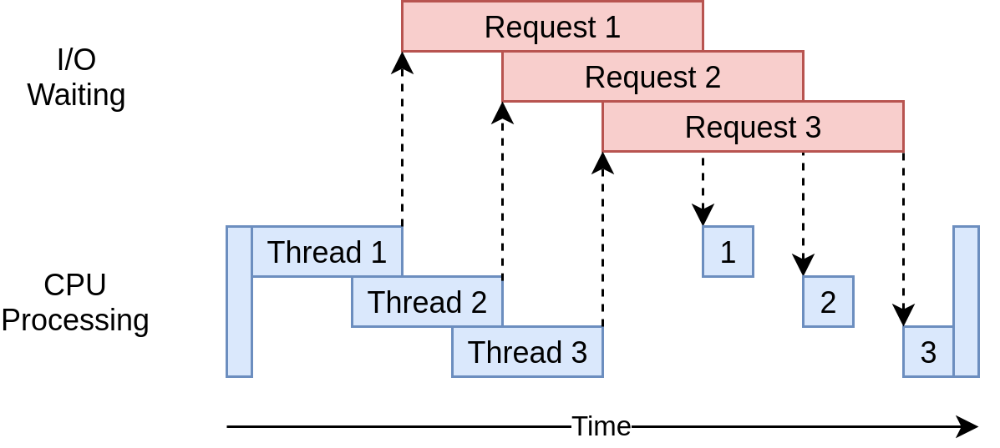

<!--
===============================================
vidgear library source-code is deployed under the Apache 2.0 License:

Copyright (c) 2019 Abhishek Thakur(@abhiTronix) <abhi.una12@gmail.com>

Licensed under the Apache License, Version 2.0 (the "License");
you may not use this file except in compliance with the License.
You may obtain a copy of the License at

   http://www.apache.org/licenses/LICENSE-2.0

Unless required by applicable law or agreed to in writing, software
distributed under the License is distributed on an "AS IS" BASIS,
WITHOUT WARRANTIES OR CONDITIONS OF ANY KIND, either express or implied.
See the License for the specific language governing permissions and
limitations under the License.
===============================================
-->

# Threaded Queue Mode

## Overview

<figure>
  
  <figcaption>Threaded-Queue-Mode: generalized timing diagram</figcaption>
</figure>

> Threaded Queue Mode is designed exclusively for VidGear's VideoCapture Gears (namely **FFGear, CamGear, and VideoGear**) and select Network Gears (such as **NetGear** Client-end) to achieve high-performance, asynchronous, and error-free video frame handling.

!!! tip "Threaded-Queue-Mode is enabled by default. It should only be [disabled](#manually-disabling-threaded-queue-mode) if strictly necessary for specific debugging purposes."

!!! info "Threaded-Queue-Mode is **NOT** required for live feeds (such as Camera Modules) and is automatically disabled to ensure minimum latency and real-time synchronization."

&nbsp; 

## What does Threaded-Queue-Mode actually do?

Threaded-Queue-Mode helps VidGear do the Threaded Video-Processing tasks in highly optimized, well-organized, and most competent way possible: 

### A. Enables Multi-Threading

> OpenCV's [`read()`](https://docs.opencv.org/master/d8/dfe/classcv_1_1VideoCapture.html#a473055e77dd7faa4d26d686226b292c1) is a [**Blocking I/O**](https://luminousmen.com/post/asynchronous-programming-blocking-and-non-blocking) function. When it fetches and decodes a frame, it halts the execution of the thread until the frame is ready. This often results in "sluggish" performance, especially on resource-constrained devices like Raspberry Pis.

TQM offloads the frame-decoding task to a dedicated [**Background Thread**](https://docs.python.org/3/library/threading.html). By overlapping I/O wait times with your main program's logic, VidGear ensures that the CPU isn't sitting idle. While one thread waits for the next frame to decode, your main thread is free to process the current one.

### B. Utilizes Fixed-Size Queues

> While multithreading is powerful, shared memory can lead to race conditions or memory leaks if not handled correctly. 

TQM solves this by using [**Thread-Safe, Fixed-Size Queues**](https://docs.python.org/3/library/queue.html#module-queue). These queues act as a synchronized buffer between the "producer" (the decoding thread) and the "consumer" (your main program). This provides a layer of thread isolation, ensuring that even if the decoding thread fluctuates in speed, your main process remains stable.

### C. Accelerates Frame Processing

By maintaining a pre-decoded buffer in memory, TQM dramatically reduces **latency**. Instead of your code asking for a frame and waiting for the hardware to decode it, the frame is already sitting in the queue, ready to be "popped" instantly.

&nbsp; 

## What are the advantages of Threaded-Queue-Mode?

- [x] **Asynchronous FIFO Handling:** _Ensures frames are processed in the correct sequential order without blocking the main loop._
- [x] **Overflow Management:** _Automatically handles synchronization between producer and consumer threads to prevent memory bloat._
- [x] **O(1) Performance:** _Utilizes efficient data structures for nearly instantaneous frame retrieval._
- [x] **Reduced Latency:** _Buffered frames ensure the "next" frame is always ready before your code asks for it._
- [x] **GIL Mitigation:** _Optimizes performance by utilizing Python’s ability to release the GIL during I/O-bound tasks._


&nbsp;


## Manually disabling Threaded-Queue-Mode

To manually disable Threaded-Queue-Mode, VidGear provides `THREADED_QUEUE_MODE` boolean attribute for `options` dictionary parameter in respective [VideoCapture APIs](../../gears/#a-videocapture-gears):  

???+ warning "Important Warnings"

	* Disabling Threaded-Queue-Mode does **NOT disables Multi-Threading.**
	* `THREADED_QUEUE_MODE` attribute does **NOT** work with Live feed, such as Camera Devices/Modules.
	* `THREADED_QUEUE_MODE` attribute is **NOT** supported by ScreenGear & NetGear APIs, as Threaded Queue Mode is essential for their core operations.


!!! danger "Disabling Threaded-Queue-Mode may lead to **Random Intermittent Bugs** or dropped frames that are difficult to debug. Only disable this if you are performing custom low-level thread management. More insight can be found [here ➶](https://github.com/abhiTronix/vidgear/issues/20#issue-452339596)""

**`THREADED_QUEUE_MODE`** _(boolean)_: This attribute can be used to override Threaded-Queue-Mode mode to manually disable it:

```python
options = {'THREADED_QUEUE_MODE': False} # to disable Threaded Queue Mode. 
```

and you can pass it to `options` dictionary parameter of the respective API.

&nbsp; 