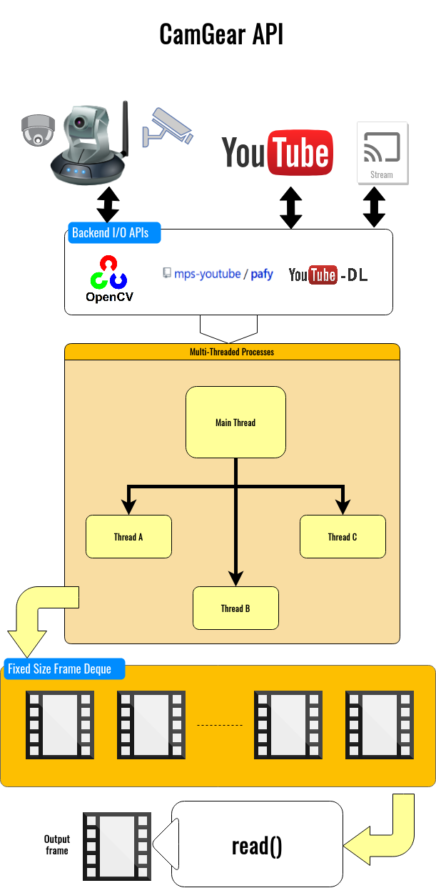

<!--
===============================================
vidgear library source-code is deployed under the Apache 2.0 License:

Copyright (c) 2019-2020 Abhishek Thakur(@abhiTronix) <abhi.una12@gmail.com>

Licensed under the Apache License, Version 2.0 (the "License");
you may not use this file except in compliance with the License.
You may obtain a copy of the License at

   http://www.apache.org/licenses/LICENSE-2.0

Unless required by applicable law or agreed to in writing, software
distributed under the License is distributed on an "AS IS" BASIS,
WITHOUT WARRANTIES OR CONDITIONS OF ANY KIND, either express or implied.
See the License for the specific language governing permissions and
limitations under the License.
===============================================
-->

# CamGear API 

<figure>
  
  <figcaption>Functional block diagram depicts CamGear API's generalized workflow</figcaption>
</figure>

## Overview

> CamGear supports a diverse range of video streams which can handle/control video stream almost any IP/USB Cameras,  multimedia video file format ([_upto 4k tested_](https://github.com/abhiTronix/vidgear/blob/62f32ad6663c871ec6aa4890ca1b55cd1286511a/vidgear/tests/benchmark_tests/test_benchmark_playback.py#L31-L71)), any network stream URL such as `http(s), rtp, rstp, rtmp, mms, etc.` In addition to this, it also supports live [Gstreamer's RAW pipelines](https://gstreamer.freedesktop.org/documentation/frequently-asked-questions/using.html) and [YouTube video/livestreams URLs](../usage/#using-camgear-with-youtube-videos).

CamGear API provides a flexible, high-level multi-threaded wrapper around OpenCV's *[VideoCapture API](https://docs.opencv.org/master/d8/dfe/classcv_1_1VideoCapture.html#a57c0e81e83e60f36c83027dc2a188e80)* with direct access to almost all of its available [*parameters*](../advanced/source_params/) and also internally employs `pafy` with `youtube-dl` backend for seamless live [*YouTube streaming*](../usage/#using-camgear-with-youtube-videos). 

CamGear relies exclusively on [**Threaded Queue mode**](../../../bonus/TQM/) for threaded, error-free and synchronized frame handling.

&thinsp; 

!!! tip "Helpful Tips"

	* If you're already familar with [OpenCV](https://github.com/opencv/opencv) library, then see [Switching from OpenCV ➶](../../switch_from_cv/#switching-videocapture-apis)

	* It is advised to enable logging(`logging = True`) on the first run for easily identifying any runtime errors.

	* You can use `framerate` class variable to retrieve framerate of the input source. Its usage example can be found [here ➶](../../writegear/compression/usage/#using-compression-mode-with-controlled-framerate)


&thinsp; 

## Importing

You can import CamGear API in your program as follows:

```python
from vidgear.gears import CamGear
```

&thinsp;

## Usage Examples

<div class="zoom">
<a href="../usage/">See here 🚀</a>
</div>

## Parameters

<div class="zoom">
<a href="../params/">See here 🚀</a>
</div>

## Reference

<div class="zoom">
<a href="../../../bonus/reference/camgear/">See here 🚀</a>
</div>


## FAQs

<div class="zoom">
<a href="../../../help/camgear_faqs/">See here 🚀</a>
</div>


&thinsp;