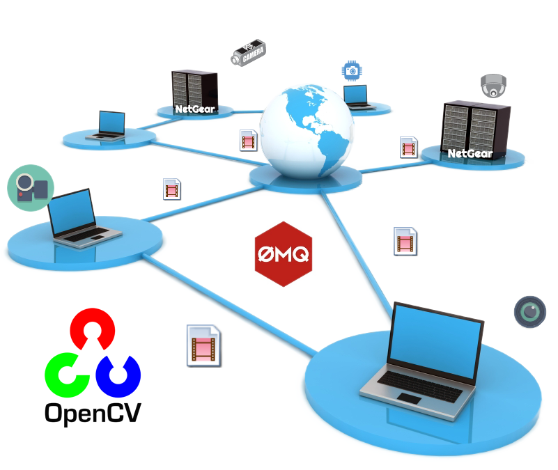

<!--
===============================================
vidgear library source-code is deployed under the Apache 2.0 License:

Copyright (c) 2019-2020 Abhishek Thakur(@abhiTronix) <abhi.una12@gmail.com>

Licensed under the Apache License, Version 2.0 (the "License");
you may not use this file except in compliance with the License.
You may obtain a copy of the License at

   http://www.apache.org/licenses/LICENSE-2.0

Unless required by applicable law or agreed to in writing, software
distributed under the License is distributed on an "AS IS" BASIS,
WITHOUT WARRANTIES OR CONDITIONS OF ANY KIND, either express or implied.
See the License for the specific language governing permissions and
limitations under the License.
===============================================
-->

# NetGear API 

<p align="center">
  
  <br>
  <sub><i>NetGear API generalised</i></sub>
</p>


NetGear is exclusively designed to transfer video frames synchronously and asynchronously between interconnecting systems over the network in real-time.

NetGear implements a high-level wrapper around [PyZmQ](https://github.com/zeromq/pyzmq) python library that contains python bindings for [ZeroMQ](http://zeromq.org/) - a high-performance asynchronous distributed messaging library that provides a message queue, but unlike message-oriented middleware, its system can run without a dedicated message broker. 

NetGear also supports real-time [*Frame Compression capabilities*](../advanced/compression/) for optimizing performance while sending the frames directly over the network, by encoding the frame before sending it and decoding it on the client's end automatically in real-time.

??? info "Lazy Pirate pattern in NetGear API"

	NetGear API now internally implements robust *Lazy Pirate pattern* (auto-reconnection) for its synchronous messaging patterns(`zmq.PAIR` & `zmq.REQ/zmq.REP`) at both Server and Client ends, where its API instead of doing a blocking receive, will:

	* Poll the socket and receive from it only when it's sure a reply has arrived.
	* Attempt to reconnect, if no reply has arrived within a timeout period.
	* Abandon the connection if there is still no reply after several requests.

	Netgear API also provides [`max_retries`](../params/#options) and [`request_timeout`](../params/#options) like attributes for controlling this polling.
 

NetGear as of now seamlessly supports three ZeroMQ messaging patterns:

* [**`zmq.PAIR`**](https://learning-0mq-with-pyzmq.readthedocs.io/en/latest/pyzmq/patterns/pair.html) _(ZMQ Pair Pattern)_ 
* [**`zmq.REQ/zmq.REP`**](https://learning-0mq-with-pyzmq.readthedocs.io/en/latest/pyzmq/patterns/client_server.html) _(ZMQ Request/Reply Pattern)_
* [**`zmq.PUB/zmq.SUB`**](https://learning-0mq-with-pyzmq.readthedocs.io/en/latest/pyzmq/patterns/pubsub.html) _(ZMQ Publish/Subscribe Pattern)_

_whereas the supported protocol are: `tcp` and `ipc`_.


&nbsp; 

## Modes of Operation

### Primary Modes

NetGear API primarily has two modes of operations:

!!! note "Remember, only either of two primary mode can be activated during Netgear API initialization, using its [`receive_mode`](../params/#receive_mode) boolean parameter."

* **Send Mode:** _which employs `send()` function to send video frames over the network in real-time. **Activate this mode by setting parameter `receive_mode = False`.**_
  
* **Receive Mode:** _which employs `recv()` function to receive frames, sent over the network with *Send Mode* in real-time. The mode sends back confirmation when the frame is received successfully in few patterns. **Activate this mode by setting parameter `receive_mode = True`.**_

### Exclusive Modes

In addition to these primary modes, NetGear API offers applications-specific Exclusive Modes:

!!! tip "Also, check this [compatibility chart](../../../help/netgear_faqs/#what-exclusive-modes-are-compatible-with-each-other-in-netgear-api) for these modes interoperability."

* **Multi-Servers Mode:** _In this exclusive mode, NetGear API robustly ==handles multiple servers at once==, thereby providing seamless access to frames and unidirectional data transfer from multiple Servers/Publishers across the network in real-time. Each new Server on the network can be identified on the client's end by using its unique port address. Also, it exhibits a feature where if all the connected servers on the network get disconnected, the client itself automatically exits to save resources. **You can learn about this mode [here ➶](../advanced/multi_server/).**_

* **Multi-Clients Mode:** _In this exclusive mode, NetGear API robustly ==handles multiple clients at once==, thereby providing seamless access to frames and unidirectional data transfer to multiple Client/Consumers across the network in real-time. Each Client on the network can be uniquely identified on the Server's end by using its unique port address. This mode is ideal for applications, where broadcasting/streaming video-frames & data from a single broadcaster to multiple connected users is required. **You can learn about this mode [here ➶](../advanced/multi_client/).**_

* **Bidirectional Mode:** _This exclusive mode ==provides seamless support for bidirectional data transmission between between Server and Client along with video frames==. Using this mode, the user can now send or receive any data(of any datatype) between Server and Client easily in real-time. **You can learn more about this mode [here ➶](../advanced/bidirectional_mode/).**_

* **Secure Mode:** _In this exclusive mode, NetGear API ==provides easy access to powerful, smart & secure ZeroMQ's Security Layers== that enables strong encryption on data, and unbreakable authentication between the Server and Client with the help of custom certificates/keys that brings cheap, standardized privacy and authentication for distributed systems over the network. **You can learn more about this mode [here ➶](../advanced/secure_mode/).**_

&nbsp; 


!!! danger "Important Information"  

		* When compiling/installing pyzmq with pip on Linux, it is generally recommended that zeromq binaries to be installed separately, via `homebrew, apt, yum, etc.` as follows:

			  ```sh
			   # Debian-based
			   sudo apt-get install libzmq3-dev
			    
			   # RHEL-based
			   sudo yum install libzmq3-devel

			   # OSX-based
			   brew install zeromq
			  ```

		  	_:warning: If zeromq binaries are not found, pyzmq will try to build `libzmq` as a Python Extension, though this is not guaranteed to work!_

		* It is advised to enable logging (`logging = True`) on the first run, to easily identify any runtime errors.

		* Kindly go through each given [Usage Examples](../usage/#netgear-api-usage-examples) thoroughly, any incorrect settings/parameter may result in errors or no output at all.

		* Only either of two functions (i.e. `send()` and `recv()`) can be accessed at any given instance based on activated [primary mode](#primary-modes) selected during NetGear API initialization. Trying to access wrong function in incorrect mode _(for e.g using `send()` function in Receive Mode)_, will result in `ValueError`.

&nbsp; 

## Importing

You can import NetGear API in your program as follows:

```python
from vidgear.gears import NetGear
```

&nbsp; 