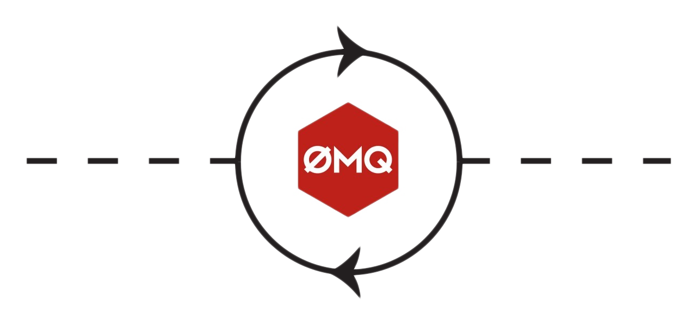

<!--
===============================================
vidgear library source-code is deployed under the Apache 2.0 License:

Copyright (c) 2019 Abhishek Thakur(@abhiTronix) <abhi.una12@gmail.com>

Licensed under the Apache License, Version 2.0 (the "License");
you may not use this file except in compliance with the License.
You may obtain a copy of the License at

   http://www.apache.org/licenses/LICENSE-2.0

Unless required by applicable law or agreed to in writing, software
distributed under the License is distributed on an "AS IS" BASIS,
WITHOUT WARRANTIES OR CONDITIONS OF ANY KIND, either express or implied.
See the License for the specific language governing permissions and
limitations under the License.
===============================================
-->

# NetGear_Async API 

<figure>
  
</figure>

## Overview

> _NetGear_Async can generate the same performance as [NetGear API](../../netgear/overview/) at about one-third the memory consumption, and also provide complete server-client handling with various options to use variable protocols/patterns similar to NetGear, but lacks in term of flexibility as it supports only a few [NetGear's Exclusive Modes](../../netgear/overview/#exclusive-modes)._

NetGear_Async is built on [`zmq.asyncio`](https://pyzmq.readthedocs.io/en/latest/api/zmq.asyncio.html), and powered by a high-performance asyncio event loop called [**`uvloop`**](https://github.com/MagicStack/uvloop) to achieve unmatchable high-speed and lag-free video streaming over the network with minimal resource constraints. NetGear_Async can transfer thousands of frames in just a few seconds without causing any significant load on your system. 

NetGear_Async provides complete server-client handling and options to use variable protocols/patterns similar to [NetGear API](../../netgear/overview/). Furthermore, NetGear_Async allows us to define our custom Server as source to transform frames easily before sending them across the network(see this [doc](../usage/#using-netgear_async-with-a-custom-sourceopencv) example).

NetGear_Async now supports additional [**bidirectional data transmission**](../advanced/bidirectional_mode) between receiver(client) and sender(server) while transferring frames. Users can easily build complex applications such as like [Real-Time Video Chat](../advanced/bidirectional_mode/#using-bidirectional-mode-for-video-frames-transfer) in just few lines of code.

In addition to all this, NetGear_Async API also provides internal wrapper around [VideoGear](../../videogear/overview/), which itself provides internal access to both [CamGear](../../camgear/overview/) and [PiGear](../../pigear/overview/) APIs, thereby granting it exclusive power for transferring frames incoming from any source to the network.

NetGear_Async as of now supports four ZeroMQ messaging patterns:

- [x] [`zmq.PAIR`](https://learning-0mq-with-pyzmq.readthedocs.io/en/latest/pyzmq/patterns/pair.html) _(ZMQ Pair Pattern)_
- [x] [`zmq.REQ/zmq.REP`](https://learning-0mq-with-pyzmq.readthedocs.io/en/latest/pyzmq/patterns/client_server.html) _(ZMQ Request/Reply Pattern)_
- [x] [`zmq.PUB/zmq.SUB`](https://learning-0mq-with-pyzmq.readthedocs.io/en/latest/pyzmq/patterns/pubsub.html) _(ZMQ Publish/Subscribe Pattern)_ 
- [x] [`zmq.PUSH/zmq.PULL`](https://learning-0mq-with-pyzmq.readthedocs.io/en/latest/pyzmq/patterns/pushpull.html#push-pull) _(ZMQ Push/Pull Pattern)_

Whereas supported protocol are: `tcp` and `ipc`.

&thinsp; 


!!! tip "Helpful Tips"

	* It is advised to enable logging(`logging = True`) on the first run for easily identifying any runtime errors.

	* It is advised to comprehend [NetGear API](../../netgear/overview/) before using this API.


&thinsp; 

## Importing

You can import NetGear_Async API in your program as follows:

```python
from vidgear.gears.asyncio import NetGear_Async
```

&thinsp;

## Usage Examples

<div>
<a href="../usage/">See here 🚀</a>
</div>

!!! example "After going through NetGear_Async Usage Examples, Checkout more bonus examples [here ➶](../../../help/netgear_async_ex/)"

## Parameters

<div>
<a href="../params/">See here 🚀</a>
</div>

## References

<div>
<a href="../../../bonus/reference/netgear_async/">See here 🚀</a>
</div>


## FAQs

<div>
<a href="../../../help/netgear_async_faqs/">See here 🚀</a>
</div> 


&thinsp;