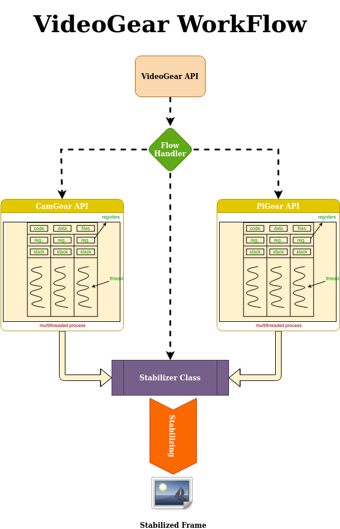

<!--
===============================================
vidgear library source-code is deployed under the Apache 2.0 License:

Copyright (c) 2019 Abhishek Thakur(@abhiTronix) <abhi.una12@gmail.com>

Licensed under the Apache License, Version 2.0 (the "License");
you may not use this file except in compliance with the License.
You may obtain a copy of the License at

   http://www.apache.org/licenses/LICENSE-2.0

Unless required by applicable law or agreed to in writing, software
distributed under the License is distributed on an "AS IS" BASIS,
WITHOUT WARRANTIES OR CONDITIONS OF ANY KIND, either express or implied.
See the License for the specific language governing permissions and
limitations under the License.
===============================================
-->

# VideoGear API 

<figure>
  
  <figcaption>VideoGear API's generalized workflow</figcaption>
</figure>

## Overview

> *VideoGear is ideal when you need to switch between multiple video-capture backends with minimal code changes. It also simplifies video stabilization for both live streams and video files, requiring very little effort and fewer lines of code.*

VideoGear API provides a special internal wrapper around VidGear's exclusive [**Video Stabilizer** :material-video-stabilization:](../stabilizer/) class.

VideoGear also serves as a common video-capture API, providing unified access to [**CamGear**](../camgear/), [**PiGear**](../pigear/), and [**FFGear**](../ffgear/) along with their respective parameters. You can switch between these backends using the [`api`](params/#api) parameter.

???+ info "Supported Backends"

    | [API](params/#api) | Backend | Best for |
    |:-----------|:---------------:|:---------|
    | `Backend.CAMGEAR` _(default)_ | [CamGear](../camgear/) | Webcams, files, network streams, streaming sites |
    | `Backend.PIGEAR` | [PiGear](../pigear/) | Raspberry Pi camera modules |
    | `Backend.FFGEAR` | [FFGear](../ffgear/) | Hardware-accelerated decoding, complex FFmpeg filtergraphs |

&thinsp; 

!!! tip "Helpful Tips"

	* If you're already familiar with [OpenCV](https://github.com/opencv/opencv) library, then see [Switching from OpenCV ➶](../../switch_from_cv/#switching-the-videocapture-apis)

	* It is advised to enable logging(`logging = True`) on the first run for easily identifying any runtime errors.

&thinsp; 

## Usage Examples

<a href="usage/">See here 🚀</a>

!!! example "After going through VideoGear Usage Examples, Checkout more of its advanced configurations [here ➶](../../help/videogear_ex/)"

## Parameters

<a href="params/">See here 🚀</a>

## References

<a href="../../bonus/reference/videogear/">See here 🚀</a>

## FAQs

<a href="../../help/videogear_faqs/">See here 🚀</a>

&thinsp; 