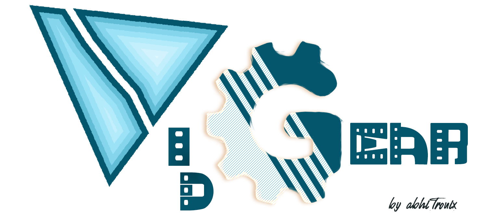

<!--
===============================================
vidgear library source-code is deployed under the Apache 2.0 License:

Copyright (c) 2019 Abhishek Thakur(@abhiTronix) <abhi.una12@gmail.com>

Licensed under the Apache License, Version 2.0 (the "License");
you may not use this file except in compliance with the License.
You may obtain a copy of the License at


   http://www.apache.org/licenses/LICENSE-2.0

Unless required by applicable law or agreed to in writing, software
distributed under the License is distributed on an "AS IS" BASIS,
WITHOUT WARRANTIES OR CONDITIONS OF ANY KIND, either express or implied.
See the License for the specific language governing permissions and
limitations under the License.
===============================================
-->

# Introduction



<h2 align="center">
	
</h2>

&thinsp;

> VidGear is a cross-platform High-Performance **Video-Processing** Framework for building complex real-time media applications in python :fire:

VidGear provides an easy-to-use, highly extensible, **[Multi-Threaded](bonus/TQM/#threaded-queue-mode) + [Asyncio](https://docs.python.org/3/library/asyncio.html) API Framework** on top of many state-of-the-art specialized libraries like *[OpenCV][opencv], [FFmpeg][ffmpeg], [ZeroMQ][zmq], [picamera][picamera], [starlette][starlette], [yt_dlp][yt_dlp], [pyscreenshot][pyscreenshot], [dxcam][dxcam], [aiortc][aiortc] and [python-mss][mss]* at its backend, and enable us to flexibly exploit their internal parameters and methods, while silently delivering robust error-handling and real-time performance ⚡️.

> _"Write Less and Accomplish More"_ — VidGear's Motto

VidGear focuses on simplicity, and thereby lets programmers and software developers to easily integrate and perform Complex Video Processing Tasks without going through hefty documentation and in just a few lines of code.

&thinsp;

## Getting Started

!!! tip "In case you're run into any problems, consult the [Help](help/get_help) section."

- [x] If this is your first time using VidGear, head straight to the [**Installation**](installation.md) to install VidGear.

- [x] Once you have VidGear installed, Checkout its **[Function-Specific Gears](gears.md)**.

- [x] Also, if you're already familar with [**OpenCV**][opencv] library, then see **[Switching from OpenCV Library](switch_from_cv.md)**.

!!! alert "If you're just getting started with OpenCV-Python programming, then refer this [FAQ ➶](help/general_faqs/#im-new-to-python-programming-or-its-usage-in-opencv-library-how-to-use-vidgear-in-my-projects)"


&thinsp;

## Gears 

> VidGear is built with multiple [Gears](gears) each with some unique functionality.

Each Gear is designed exclusively to handle/control/process different data-specific & device-specific video streams, network streams, and media encoders/decoders.

These Gears can be classified as follows:

#### VideoCapture Gears

* [CamGear](gears/camgear/overview/): Multi-Threaded API targeting various IP-USB-Cameras/Network-Streams/Streaming-Sites-URLs.
* [PiGear](gears/pigear/overview/): Multi-Threaded API targeting various Raspberry-Pi Camera Modules.
* [ScreenGear](gears/screengear/overview/): High-performance API targeting rapid Screencasting Capabilities.    
* [VideoGear](gears/videogear/overview/): Common Video-Capture API with internal [_Video Stabilizer_](gears/stabilizer/overview/) wrapper.

#### VideoWriter Gears

* [WriteGear](gears/writegear/introduction/): Handles Lossless Video-Writer for file/stream/frames Encoding and Compression.

#### Streaming Gears

* [StreamGear](gears/streamgear/introduction/): Handles Transcoding of High-Quality, Dynamic & Adaptive Streaming Formats.

* **Asynchronous I/O Streaming Gear:**

    * [WebGear](gears/webgear/overview/): ASGI Video-Server that broadcasts Live MJPEG-Frames to any web-browser on the network.
    * [WebGear_RTC](gears/webgear_rtc/overview/): Real-time Asyncio WebRTC media server for streaming directly to peer clients over the network.

#### Network Gears

* [NetGear](gears/netgear/overview/): Handles High-Performance Video-Frames & Data Transfer between interconnecting systems over the network.

* **Asynchronous I/O Network Gear:**

    * [NetGear_Async](gears/netgear_async/overview/): Immensely Memory-Efficient Asyncio Video-Frames Network Messaging Framework. 

&thinsp;

## Contributions

> Contributions are welcome, and greatly appreciated!  

Please see our [**Contribution Guidelines**](contribution.md) for more details.

&thinsp;

## Community Channel

If you've come up with some new idea, or looking for the fastest way troubleshoot your problems. Please checkout our [**Gitter community channel ➶**][gitter]

&thinsp; 

## Become a Stargazer

You can be a [**Stargazer** :star2:{ .heart }][stargazer] by starring us on Github, it helps us a lot and you're making it easier for others to find & trust this library. Thanks!

&thinsp;

## Donations

> VidGear is free and open source and will always remain so. :heart:{ .heart }

It is something I am doing with my own free time. But so much more needs to be done, and I need your help to do this. For just the price of a cup of coffee, you can make a difference :slight_smile:

<script type='text/javascript' src='https://ko-fi.com/widgets/widget_2.js'></script><script type='text/javascript'>kofiwidget2.init('Support Me on Ko-fi', '#eba100', 'W7W8WTYO');kofiwidget2.draw();</script> 

&thinsp;

## Citation

Here is a Bibtex entry you can use to cite this project in a publication:

[](https://doi.org/10.5281/zenodo.7571405)

```BibTeX
@software{vidgear,
  author       = {Abhishek Thakur and
                  Zoe Papakipos and
                  Christian Clauss and
                  Christian Hollinger and
                  Ian Max Andolina and
                  Vincent Boivin and
                  enarche-ahn and
                  freol35241 and
                  Benjamin Lowe and
                  Mickaël Schoentgen and
                  Renaud Bouckenooghe},
  title        = {abhiTronix/vidgear: VidGear v0.3.0},
  month        = jan,
  year         = 2023,
  publisher    = {Zenodo},
  version      = {vidgear-0.3.0},
  doi          = {10.5281/zenodo.7571405},
  url          = {https://doi.org/10.5281/zenodo.7571405}
}
```

&thinsp;

<!--
External URLs
-->

[opencv]:https://github.com/opencv/opencv
[picamera]:https://github.com/waveform80/picamera
[pafy]:https://github.com/mps-youtube/pafy
[zmq]:https://zeromq.org/
[mss]:https://github.com/BoboTiG/python-mss
[gitter]: https://gitter.im/vidgear/community
[starlette]:https://www.starlette.io/
[stargazer]: https://github.com/abhiTronix/vidgear/stargazers
[ffmpeg]:https://www.ffmpeg.org/
[pyscreenshot]:https://github.com/ponty/pyscreenshot
[streamlink]:https://streamlink.github.io/
[aiortc]:https://aiortc.readthedocs.io/en/latest/
[yt_dlp]:https://github.com/yt-dlp/yt-dlp
[dxcam]:https://github.com/ra1nty/DXcam